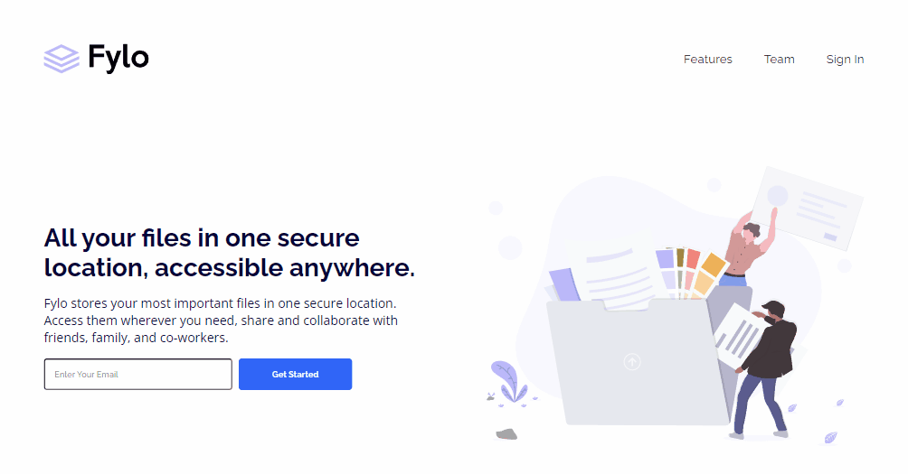
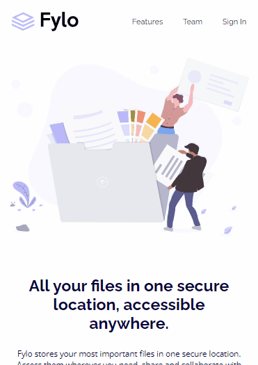

# Desafio Landing Page Fylo - Frontend-Mentor

Este é um desafio de Landing Page para a Fylo proposto pelo site Frontend-Mentor.

## Tabela de Conteúdos

- [Visão Geral](#visão-geral)
    - [Imagens](#imagens)
    - [Link da página](#link)
- [Processo](#processo)
    - [Linguagens utilizadas](#linguagens-utilizadas)
    - [O que aprendi](#o-que-aprendi)
    - [Possíveis evoluções](#possíveis-evoluções)
- [Autor](#autor)

## Visão-geral

### Imagens

<br>

````
Versão de Desktop
````

   

<br>

````
Versão Mobile
````

 

### Link

- Página no GitHub Pages: <a href="https://julio-mansan2.github.io/landing-page-fylo/">Clique aqui!</a>

## Processo

### Linguagens utilizadas

<br>

- Marcações semânticas de HTML5
- Propriedades de customização do CSS3

<br>

### O que aprendi

<br>

- Utilizar um sistema de formulário com input e form: 

````html

<form>
    <input type="email" name="email" value="" id="email" placeholder="Enter Your Email">
    <input type="submit" value="Get Started" id="submit">
</form>

````

<br>

- Encaixar todos os ícones do font-awesome com "fa-fw":

````html

<a href="">
    <i class="fab fa-fw fa-instagram"></i>
</a>

````
<br>

- Aplicar sombras em elementos:

````css

.element {
    box-shadow: 0px 0px 2px 1px rgba(0,0,0,0.75);
}

````
<br>

### Possíveis evoluções

<br>

- Utilizar menos divs;
- Organizar melhor os elementos.

<br>

## Autor

GitHub - <a href="https://github.com/julio-mansan2">julio-mansan2</a> <br>
Front-end Mentor - <a href="https://www.frontendmentor.io/profile/julio-mansan2">julio-mansan2</a> <br>